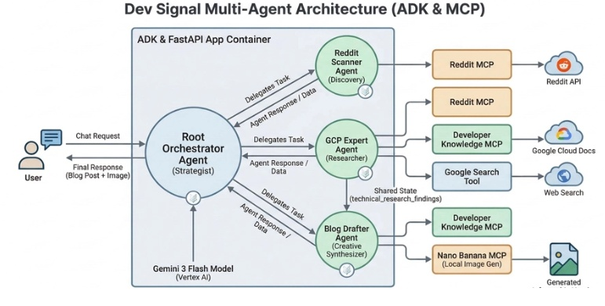

# Shadow Monarch

AI-powered social media content pipeline — generate thread Twitter/X dan artikel Dev.to secara otomatis pakai multi-agent system berbasis Gemini AI.



> **Note:** Gambar arsitektur di atas diambil dari internet. Mohon maaf jika ada yang merasa keberatan — silakan hubungi saya agar bisa dicantumkan sumbernya atau diganti.

## Cara Kerja

```
Request (topic)
    │
    ▼
┌──────────────────────────┐
│     Orchestrator         │  Coordinator — distribusi tugas ke agents
└─────┬────────────┬───────┘
      │            │
      ▼            ▼
┌───────────┐ ┌────────────┐
│ XScanner  │ │ GCPExpert  │  ← Parallel (goroutines)
│ (trends)  │ │ (research) │
└─────┬─────┘ └─────┬──────┘
      │             │
      └──────┬──────┘
             ▼
       ┌───────────┐
       │ XDraft    │  ← Sequential — draft konten dari combined context
       └─────┬─────┘
             ▼
      Generated Content
        ┌────┴────┐
        ▼         ▼
    Return     Post ke X/Dev.to
```

**3 agents berjalan berurutan:**
1. **XScanner** — analisis tren & engagement pattern di X/Twitter
2. **GCPExpert** — riset teknikal mendalam (Golang, Flutter, Android, Architecture)
3. **XDraft** — draft thread Twitter atau artikel Dev.to dari hasil riset

## Prasyarat

- Go 1.26.4+
- API Keys:
  - **Gemini API Key** — https://aistudio.google.com/apikey
  - **X/Twitter Bearer Token** — dari developer portal X
  - **Dev.to API Key** — dari Settings → Extensions di dev.to

## Setup

```bash
git clone https://github.com/your-username/shadow-monarch.git
cd shadow-monarch
go mod download
```

Buat file `.env` di root project:

```env
GEMINI_API_KEY=your_gemini_api_key
X_BEARER_TOKEN=your_x_bearer_token
DEVTO_API_KEY=your_devto_api_key
```

## Menjalankan

```bash
go run cmd/app/main.go
```

Server berjalan di `http://localhost:9099`.

## API Endpoints

| Method | Endpoint | Deskripsi |
|--------|----------|-----------|
| `GET` | `/health` | Health check |
| `POST` | `/generate` | Generate konten & post berdasarkan platform |
| `POST` | `/chat` | Chat langsung dengan agent |

### Generate & Post

```bash
# Generate saja (tanpa post) - default platform: devto
curl -X POST http://localhost:9099/generate \
  -H "Content-Type: application/json" \
  -d '{"topic": "Kenapa gw pindah ke Go buat backend", "auto_post": false}'

# Generate + auto post ke Dev.to
curl -X POST http://localhost:9099/generate \
  -H "Content-Type: application/json" \
  -d '{"topic": "Kenapa gw pindah ke Go buat backend", "auto_post": true, "platform": "devto"}'

# Generate + auto post ke X/Twitter
curl -X POST http://localhost:9099/generate \
  -H "Content-Type: application/json" \
  -d '{"topic": "Kenapa gw pindah ke Go buat backend", "auto_post": true, "platform": "x"}'
```

**Platform options:** `devto` (default) atau `x`

### Chat

```bash
curl -X POST http://localhost:9099/chat \
  -H "Content-Type: application/json" \
  -d '{"message": "Jelaskan goroutines dalam Go"}'
```

## Struktur Project

```
shadow_monarch/
├── cmd/
│   └── app/
│       └── main.go              # Entry point — HTTP server & routing
├── internal/
│   ├── orchestrator/
│   │   └── engine.go            # Central orchestrator — koordinasi agents
│   ├── agents/
│   │   ├── x_scanner.go         # Agent analisis tren X/Twitter
│   │   ├── gcp_expert.go        # Agent riset teknikal
│   │   └── x_drafter.go         # Agent draft thread & artikel
│   └── mcp/
│       ├── x_server.go          # Client X/Twitter API v2
│       ├── devto_server.go      # Client Dev.to API
│       └── image_gen.go         # Image generation (placeholder)
├── go.mod
├── go.sum
└── .env
```

## Tech Stack

- **Go 1.26.4** — bahasa utama
- **Google Gemini 2.5 Flash** — AI backend untuk semua agents
- **X/Twitter API v2** — posting threads via Bearer token
- **Dev.to API** — publish artikel
- **godotenv** — load `.env` file

## License

Personal project.
